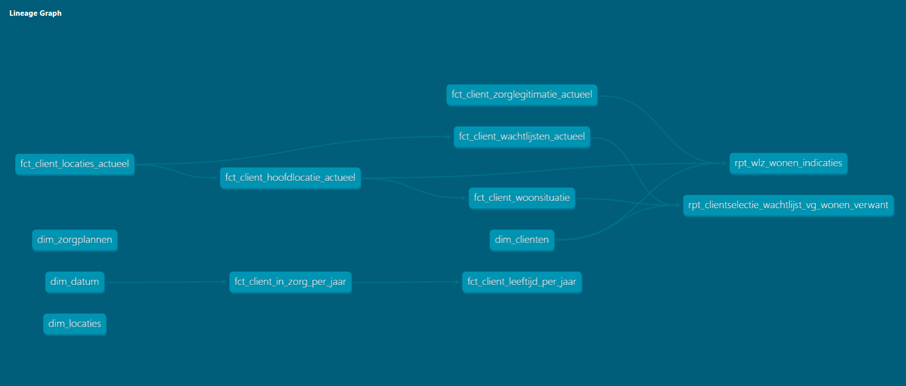

# 🧱 Odion Data Platform

Dit project bevat de dbt-modellen en scripts voor het **Odion Data Platform**.  

---

## ⚙️ Werken met Poetry en dbt

Dit project gebruikt **[Poetry](https://python-poetry.org/)** voor dependency-management en **dbt** voor datatransformaties.  
Volg onderstaande stappen om lokaal aan de slag te gaan.

### 🚀 Eerste keer opstarten

1. **Installeer de afhankelijkheden**

   ```bash
   poetry install
   ```

   Hiermee worden alle benodigde Python-pakketten geïnstalleerd in een virtuele omgeving.

2. **Activeer de Poetry-omgeving**

   ```bash
   poetry shell
   ```

   (Gebruik `exit` om de omgeving weer te verlaten.)

3. **Controleer of dbt werkt**

   ```bash
   dbt --version
   ```

---

## 🧩 Werken met dbt

| Commando | Beschrijving |
|-----------|---------------|
| `dbt debug` | Controleert de databaseverbinding |
| `dbt run` | Bouwt alle modellen (views/tabellen) |
| `dbt test` | Voert datatests uit |
| `dbt docs generate && dbt docs serve` | Genereert en toont dbt-documentatie lokaal |
| `poetry run <commando>` | Voer een commando uit zonder eerst `poetry shell` te openen |

Voorbeeld:
```bash
poetry run dbt run
```

---

## 📁 Projectstructuur

De dbt-modellen zijn georganiseerd volgens een layered architecture (*staging → intermediate → marts*). Binnen marts zijn de analytische eindmodellen verder ingedeeld in dimensions, facts en reports.

```text
.
├── models/
│   ├── staging/            # Ruwe data (bron-nabij, opschoning/normalisatie)
│   ├── intermediate/       # Businesslogica & verrijkingen (herbruikbare tussenlagen)
│   └── marts/              # Analytische eindmodellen (consumptielaag)
│       ├── dimensions/     # Dimensionele tabellen (beschrijvende entiteiten)
│       ├── facts/          # Feitentabellen (metingen/gebeurtenissen op een duidelijke grain)
│       └── reports/        # Rapportage-/selectieviews (BI-ready, met filters/joins)
├── tests/                  # Eventuele dbt tests
├── dbt_project.yml         # dbt projectconfiguratie
├── pyproject.toml          # Poetry dependency management
└── README.md

```

---

## 🧭 Datamodel (overzicht)

Onderstaande afbeelding geeft een globaal overzicht van de marts-laag (dimensions, facts en reports) en hun onderlinge relaties.

ℹ️ Dit overzicht is indicatief.
Voor de actuele en volledige documentatie (incl. lineage, kolommen en afhankelijkheden) gebruik je:

```
dbt docs generate
dbt docs serve
```


